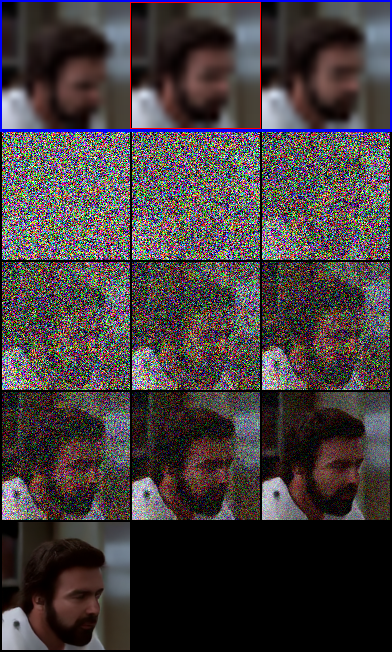
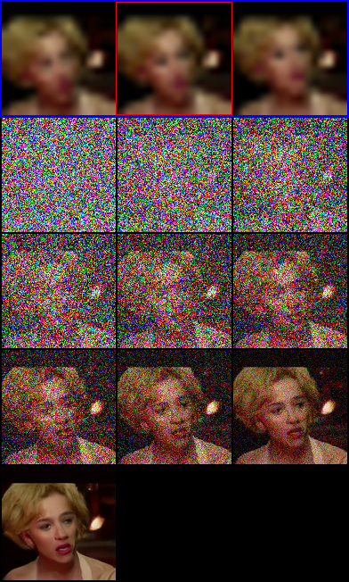
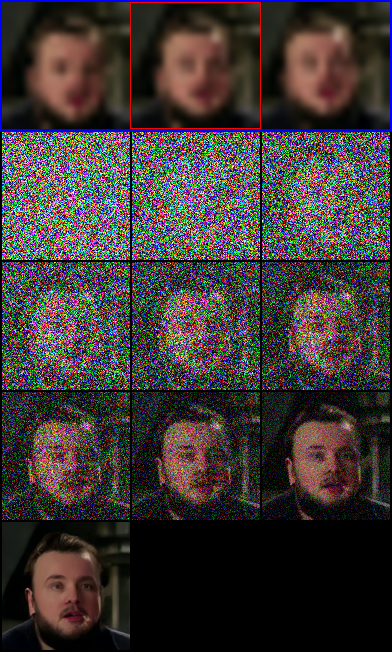
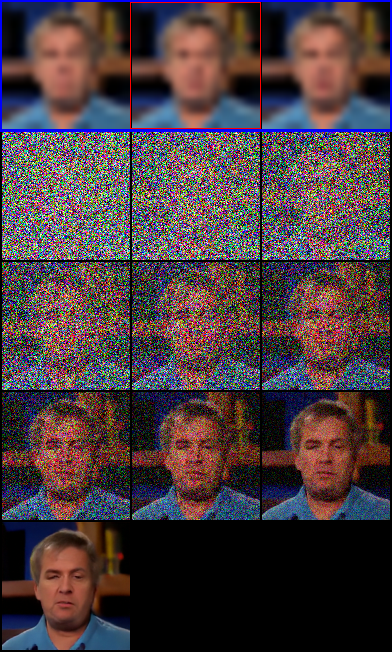
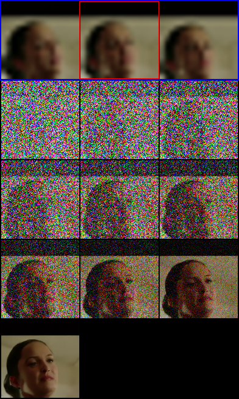
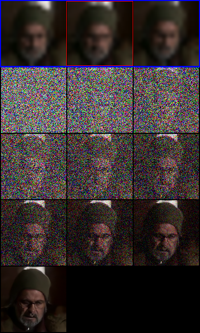

## Multi-frame Super-Resolution via Iterative Refinement

## Introduction

This repository is a fork of [Image Super-Resolution via Iterative Refinement](https://github.com/Janspiry/Image-Super-Resolution-via-Iterative-Refinement), inheriting scripts and code from the original project. The purpose of this fork is to build upon the existing work and add additional features to perform multi-frame super-resolution task.

Multi-frame Super-resolution (MFSR) is the process of taking multiple low-resolution (LR) video frames to construct a single high-resolution (HR) frame. This problem is a vital subtask to a more general problem of Video Super-resolution (VSR). On the other hand, Single Image Super-resolution (SSIR), an equivalent process that reconstructs HR image from a given LR image, has achieved significant advancements recently, and can be used partly to tackle VSR. Nevertheless, VSR remains a difficult problem without an optimal solution. Theoretically, the temporal information in a sequence of adjacent frames will allow us to make a more accurate prediction than using a single frame alone. Thus, one can utilize the proven techniques from SSIR to perform super-resolution using multiple frames.

With the rise of deep learning research, the convolutional neural network (CNN)-based SSIR algorithms have shown excellent performance and advancement. The Super-resolution Convolutional Neural Network (SRCNN) algorithm [1] applies CNN to image super-resolution problem for the first time, which presents a significant improvement to traditional methods. Following this approach, VDSR algorithm [2] employs a very deep residual network and also demonstrates desirable results. By minimizing the mean squared reconstruction error, these methods could achieve high peak signal-to-noise ratio (PSNR). However, the super-resolved images often lack high-frequency details, making them become perceptually unsatisfying and fail to match the expected fidelity. In order to solve the problem of overly smooth reconstructed images and loss of high-frequency texture, Super-resolution Generative Adversarial Network (SRGAN) algorithm [3] designs a loss function closer to perceptual similarity instead of similarity in pixel space. The reconstruction result is indeed more photo-realistic and visually convincing than other existing methods. Nevertheless, the inner-outer loop optimization in GAN often requires tricks to stabilize training, and conditional tasks like super-resolution usually require an auxiliary consistency-based loss to avoid mode collapse [4].

Within the scope of a personal project, we take advantages of the SR3 algorithm [4], which perform SSIR via iterative refinements, to solve the problem of MFSR. SR3 works by adapting Denoising Diffusion Probabilistic Models (DDPM) [5] to conditional image generation and performs super-resolution through a stochastic iterative denoising process. The output generation starts with a pure Gaussian noise and iteratively refines the noisy image through a sequence of steps. This process uses a U-Net model trained on denoising at various noise level. Different from GANs that rely on inner-loop maximization, SR3 minimizes a well-defined loss function, and consistently yields super-resolution outcomes that are comparable in quality to SRGAN. In our approach, we tweak the SR3 model with some minor modifications to perform multi-frame super-resolution. Our main adjustment is using the training input data consisting of multiple frames extracted from videos instead of using static images. We experiment with different noise schedules and number of time steps, while retaining other hyperparameters in the original paper [4]. The model is trained on a dataset of frames from videos in CelebV-HQ Dataset [6]. Due to limited computational resources,  we can only perform the training for a moderate number of iterations. While the super-resolution frames fall short of the expected fidelity, they exhibit promising potentials. We anticipate that an increase in the number of training steps alongside appropriate fine-tuning will enhance the outcome.

## Table of Contents

## Installation

Prepare the environment

```bash
pip install -r requirement.txt
```

## Dataset

I trained the SR3 model on the frames extracted from videos in [CelebV-HQ Video Dataset](https://celebv-hq.github.io/). To download the CelebV-HQ videos and extract frames from those videos, please follow the guide in this repository [Download, process and extract frames from CelebV-HQ videos](https://github.com/felixlephuoc/Download-Process-CelebV-HQ.git).

## Usage

### Data processing

Once you have the frames dataset extracted from CelebV-HQ videos, you can process it to get the low-resolution (LR), high-resolution (HR) and the "fake" super-resolution (SR) frames in PNG format using the script below. The "fake" SR frames are upscaled from the LR frames to the resolution of HR frames using bicubic interpolation.

```bash
python3 data/prepare_data.py  --frames_path [dataset root] --n_frames 3 --interval [temporal stride] --split [train/val] --out [output root] --size 16,128
```

The directory containing processed frames should be organized like this:

```bash
celebvhq_frames_16_128/
	├── hr_128
	│   ├── video_id_1
	│   │   ├── frame_0_hr_128.png
	│   │   ├── frame_1_hr_128.png
	│   │   └── frame_2_hr_128.png
	│   ├── video_id_2
	│   └── ...
	├── lr_16
	│   ├── video_id_1
	│   │   ├── frame_0_lr_16.png
	│   │   ├── frame_1_lr_16.png
	│   │   └── frame_2_lr_16.png
	│   ├── video_id_2
	│   └── ...
	└── sr_16_128
    	    ├── video_id_1
    	    │   ├── frame_0_sr_128.png
    	    │   ├── frame_1_sr_128.png
    	    │   └── frame_2_sr_128.png
    	    ├── video_id_2
    	    └── ...
```

### Configuration

In the config file, you need to specify the paths to train and validation dataset as well as the image resolutions.

```json
    "datasets": {
        "train": {
            "name": "CelebV-HQ",
            "dataroot": "dataset/celebvhq_frames_16_128_train",
            "datatype": "img", //lmdb or img
            "l_resolution": 16, // low resolution need to super_resolution
            "r_resolution": 128, // high resolution
            "batch_size": 16,
            "data_len": -1 // -1 represents all data used in train
	    ...
        },
        "val": {
            "name": "CelebV-HQ",
            "dataroot": "dataset/celebvhq_frames_16_128_val",
            "datatype": "img",
            "l_resolution": 16,
            "r_resolution": 128,
            "data_len": 100 //number of samples used in validation
            ...
        }
    },
```

You can also edit the json config file to adjust the network architecture and other hyperparameters.

### Training

Run the `sr.py` script to start or resume training process:

```bash
python3 sr.py -c config/sr3_frames_16_128.json -p train
```

### Evaluation

Edit the json files to add the pretrained model path:

```json
    "path": {
        "resume_state": "pretrained_model/I200000_E110" //pretrain model or training state
    }
```

Run the evaluation using `sr.py` script:

```bash
python3 sr.py -c config/sr3_frames_16_128.json -p val
```

## Result

The model is trained on a single Nvidia V100 GPU for a moderate number of iterations. Moreover, the image noise and hue deviation occasionally appear in the high-resolution frames, resulting in low scores. There is still a lot of room for further optimization. All contributions to improve the results are welcome.

### Automated Metrics

|       Tasks/Metrics       | SSIM (+) | PSNR (+) |
| :-----------------------: | :------: | :------: |
| 16 x 16&rarr; 128 x 128 |   0.51   |  18.37  |
| 64 x 64&rarr; 512 x 512 |    -    |    -    |

### Qualitative Results

- #### 16 x 16 &rarr; 128 x 128 Super-resolution on CelebV-HQ

  The visualizations of sampling procedure are shown below. The frames inside blue box are the upscaled LR input frames. The frame inside red box is the target frame that we want to super-resolve. The inference process starts from pure noise and go through a number of refinement steps to produce the final super-resolved frame. We set the maximum number of timesteps $T=2000$. Each intermediate output frame in the grid images represents the result after 200 denoising iterations. The reference HR frames are not included because of privacy concern.

  |  |  |  |
  | ------------------------------------------------- | ------------------------------------------------- | ------------------------------------------------- |

  |  |  |  |
  | ------------------------------------------------- | ------------------------------------------------- | ------------------------------------------------- |
- #### 64 x 64 &rarr; 512 x 512 Super-resolution on CelebV-HQ

  - [ ] TODO

## Acknowledgement

I sincerely thank Profesor Michal Fabinger for his guidance and support while conducting this project.

## References

[1]  C. Dong, C. C. Loy, K. He, and X. Tang, "Image super-resolution using deep convolutional networks," *IEEE Trans. Pattern Anal. Mach. Intell.*, vol. 38, no. 2, pp. 295–307, Feb. 2016

[2] J. Kim, J. K. Lee, and K. M. Lee, "Accurate image super-resolution using very deep convolutional networks," in *Proc. IEEE Conf. Comput. Vis.Pattern Recognit. (CVPR),* Jun. 2016, pp. 1646–1654

[3] C. Ledig et al., "Photo-Realistic Single Image Super-Resolution Using a Generative Adversarial Network," 2017 IEEE Conference on Computer Vision and Pattern Recognition (CVPR), Honolulu, HI, USA, 2017, pp. 105-114, doi: 10.1109/CVPR.2017.19.

[4] C. Saharia, J. Ho, W. Chan, T. Salimans, D. J. Fleet and M. Norouzi, "Image Super-Resolution via Iterative Refinement," in  *IEEE Transactions on Pattern Analysis and Machine Intelligence* , vol. 45, no. 4, pp. 4713-4726, 1 April 2023, doi: 10.1109/TPAMI.2022.3204461.

[5] Jonathan Ho, Ajay Jain, and Pieter Abbeel. Denoising diffusion probabilistic models. arXiv:2006.11239, 2020.

[6] Zhu, H., Wu, W., Zhu, W., Jiang, L., Tang, S., Zhang, L., Liu, Z., & Loy, C.C. CelebV-HQ: A Large-Scale Video Facial Attributes Dataset. arXiv:2207.12393, 2022.
